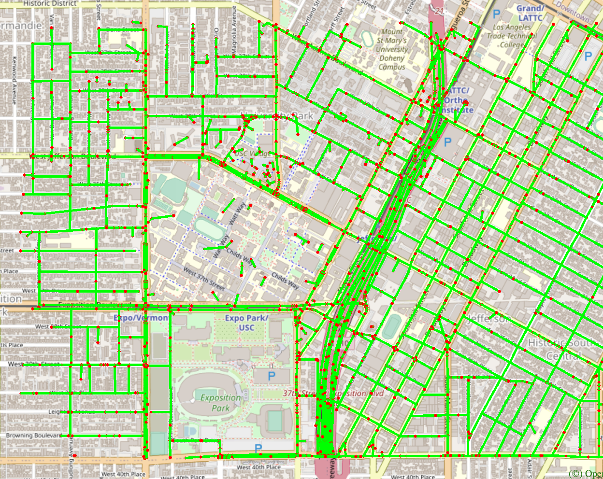
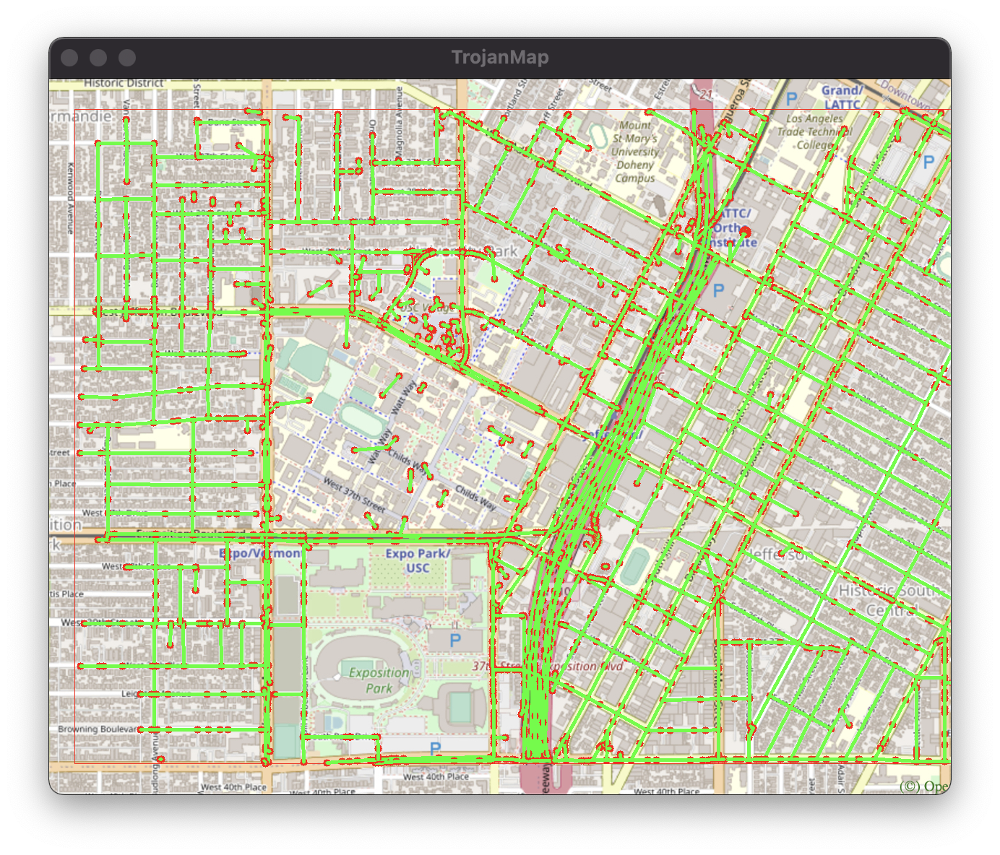
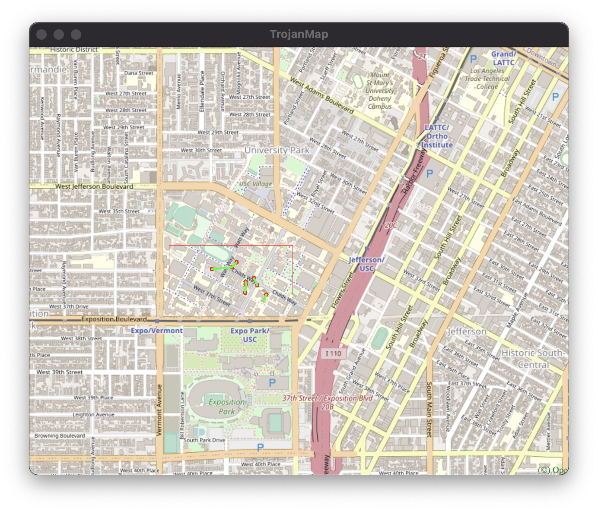

# TrojanMap

## Contact Information: 

Name: Lei Lu

Email: lulei@usc.edu

## TrojanMap

This project focuses on using data structures in C++ and implementing various graph algorithms to build a map application.

<p align="center"></p>

---

## The data Structure

Each point on the map is represented by the class **Node** shown below and defined in [trojanmap.h](src/lib/trojanmap.h).

```cpp
class Node {
  public:
    std::string id;    // A unique id assign to each point
    double lat;        // Latitude
    double lon;        // Longitude
    std::string name;  // Name of the location. E.g. "Bank of America".
    std::vector<std::string>
        neighbors;  // List of the ids of all neighbor points.
};

```

---

## Prerequisites

### OpenCV Installation

For visualization, we use OpenCV library. You will use this library as a black box and don't need to worry about the graphic details.

Use the following commands to install OpenCV.

```shell
$ cd 2021Fall_TrojanMap
$ git clone https://github.com/opencv/opencv.git
```

### Other library Installations

For Ubuntu:
```shell
$ sudo apt-get install cmake libgtk2.0-dev pkg-config
$ sudo apt install libcanberra-gtk-module libcanberra-gtk3-module
$ sudo apt-get install libncurses5-dev libncursesw5-dev
$ cp ubuntu/* ./
```

For MacOS:
```shell
$ brew install cmake
$ brew install ncurses
```

Next, type the following, but make sure that you set the **path_to_install_folder** to be the absolute path to the install folder under opencv.

```shell
$ cd opencv/
$ mkdir build install
$ cd build
$ cmake -D CMAKE_INSTALL_PREFIX=**path_to_install_folder**\
 -D BUILD_LIST=core,highgui,imgcodecs,imgproc,videoio\
 -D WITH_TBB=ON -D WITH_OPENMP=ON -D WITH_IPP=ON\
 -D CMAKE_BUILD_TYPE=RELEASE -D BUILD_EXAMPLES=OFF\
 -D WITH_NVCUVID=ON\
 -D WITH_CUDA=ON\
 -D BUILD_DOCS=OFF\
 -D BUILD_PERF_TESTS=OFF\
 -D BUILD_TESTS=OFF\
 -D WITH_CSTRIPES=ON\
 -D WITH_OPENCL=ON ..
$ make install
```

For example, if cloned this repo under "/Users/ari/github/TrojanMap", you should type:

```shell
$ cd opencv/
$ mkdir build install
$ cd build
$ cmake -D CMAKE_INSTALL_PREFIX=/Users/ari/github/TrojanMap/opencv/install\
 -D BUILD_LIST=core,highgui,imgcodecs,imgproc,videoio\
 -D WITH_TBB=ON -D WITH_OPENMP=ON -D WITH_IPP=ON\
 -D CMAKE_BUILD_TYPE=RELEASE -D BUILD_EXAMPLES=OFF\
 -D WITH_NVCUVID=ON\
 -D WITH_CUDA=ON\
 -D BUILD_DOCS=OFF\
 -D BUILD_PERF_TESTS=OFF\
 -D BUILD_TESTS=OFF\
 -D WITH_CSTRIPES=ON\
 -D WITH_OPENCL=ON ..
$ make install
```

---

## Run the program

Please run:

```shell
$ bazel run src/main:main
```

If everything is correct, this menu will show up.

```shell
Torjan Map
**************************************************************
* Select the function you want to execute.                    
* 1. Autocomplete                                             
* 2. Find the position                                        
* 3. CalculateShortestPath                                    
* 4. Travelling salesman problem                              
* 5. Cycle Detection                                          
* 6. Topological Sort                                         
* 7. Find K Closest Points                                    
* 8. Exit                                                     
**************************************************************
Please select 1 - 8:
```


## First task is to implement a function for each menu item

## Step 1: Autocomplete the location name

```c++
std::vector<std::string> Autocomplete(std::string name);
```

We consider the names of nodes as the locations. Implement a method to type the partial name of the location and return a list of possible locations with partial name as prefix. Please treat uppercase and lower case as the same character.

Example:

Input: "Saint" \
Output: 
<p align="center"></p>


## Step 2: Find the place's Coordinates in the Map

```c++
std::pair<double, double> GetPosition(std::string name);
```

Given a location name, return the latitude and longitude. There are no duplicated location names. You should mark the given locations on the map. If the location does not exist, return (-1, -1).

Example:

Input: "Our Savior Chapel" \
Output: 
<p align="center"></p>

<p align="center"></p>

## Step 3: CalculateShortestPath between two places

```c++
std::vector<std::string> CalculateShortestPath_Dijkstra(std::string &location1_name,
                                               std::string &location2_name);
std::vector<std::string> CalculateShortestPath_Bellman_Ford(std::string &location1_name,
                                               std::string &location2_name);
```

Given 2 locations A and B, find the best route from A to B. The distance between 2 points is the euclidean distance using latitude and longitude. 

Example:

Input: "Target", "ChickfilA" \
Output: [ "2578244375", "5559640911", "6787470571", "6808093910", "6808093913", "6808093919", "6816831441", "6813405269", "6816193784", "6389467806", "6816193783", "123178876", "2613117895", "122719259", "6807243574", "6807243576", "213332111", "441895337", "441895335", "122719255", "2613117893", "6813405231", "122719216", "6813405232", "4015372486", "7071032399", "4015372485", "6813379479", "5237417650" ]

<p align="center"></p>

Comparing the result with the route in Apple Maps, we can find that The result in Trojan Map is very similar to the route in Apple Maps.

<p align="center"></p>

Both Dijkstra Algorithm and Bellman-Ford Algorithm can get the same answer, but rum time is different.

**Complexity of Dijkstra with heap-optimization is O(nlogm), where n is the number of points and m is the number of edges in map.**

**Complexity of Bellman-Ford with queue-optimization is O(nm) in worst cases and O(n) generally, where n is the number of points and m is the number of edges in map.**

In this example, runtime of Dijkstra is 23521 msec, runtime of Bellman-Ford is 76848 msec.

<p align="center"></p>
<p align="center"></p>

## Step 4: The Traveling Trojan Problem (AKA Traveling Salesman!)

Given a complete graph(a vector of location ids), which means each node is a neighbor of all other nodes(every location can reach all other locations in the vector).Find the shortest route that covers all the locations exactly once and goes back to the start point. 

There are severao algorithms can be used. Now selecting N random points on the map a to find the path to travel these points and back to the start point and compare those algorithms.

- Backtracking

Backtracking can always get the optimal solution since it will traverse all possible routes.

```c++
std::pair<double, std::vector<std::vector<std::string>>> TravellingTrojan(
      std::vector<std::string> &location_ids);
```

<p align="center"></p>

<p align="center"></p>

<p align="center"></p>

However, to get such an accurate result cost much time. The run time in this case is 507691 msec. Complexity of Backtracking is O(n!), where n is the number of points. Of course we can also get the Optimal solution by using Backtracking since it will traver all possible solutions.

- [2-opt Heuristic](https://en.wikipedia.org/wiki/2-opt). Also see [this paper](http://cs.indstate.edu/~zeeshan/aman.pdf)

2-opt is one of the simplest Heuristic Algorithm. The main idea behind it is to take a route that crosses over itself and reorder it so that it does not. 
[The image below illustrates this issue](http://pedrohfsd.com/2017/08/09/2opt-part1.html).

<p align="center"></p>

This is the same as changing E,A,C,B,D,F,E into E,A,B,C,D,F,E. Visually one can intuitively associate this to a rectangle and note that A,C and B,D are like diagonals which would then be greater than the laterals A,B and C,D. This is obviously a generalization though.

```c++
std::pair<double, std::vector<std::vector<std::string>>> TravellingTrojan_2opt(
      std::vector<std::string> &location_ids);
```

<p align="center"></p>

<p align="center"></p>

<p align="center"></p>

It can be seen that 2-opt can not always get the optimal solution but the run time is much shorter than Backtracking. Complexity of 2-opt is O(n^2), where n is the number of locations. 

- [2-opt with SA](https://en.wikipedia.org/wiki/Simulated_annealing)

Simulated Annealing(SA) is a probabilistic technique for approximating the global optimum of a given function. In TSP, the given function is the total length of traveling all locations and we want to get the minimun result. Unlike 2opt, it will not always move in the direction of local optima. If the new solution is better, then iterate to the new solution. On the contrary, iterate to a new solution with a little probability. This probability is related to the degree of excellence of the solution, and also related to the "temperature" of the SA. 2-opt with SA can make 2-opt not easy to fall into the local optimal situation. 

<p align="center"></p>

<p align="center"></p>

<p align="center"></p>

There is a mature method for parameter selection of SA. Normally, if we want to get a better result, we must spend more time. When solving TSP, we can set the simulated annealing time to a time that the customer can tolerate. 

- [3-opt](http://cs.indstate.edu/~zeeshan/aman.pdf)

In 2-opt move we remove 2 links from cyclic tour, this way obtaining 2 open segments, which we can manipulate and combine them to get a new tour. In 3-opt we remove 3 links, obtaining 3 segments to manipulate. This gives us eight combinations (including the tour identical with the initial one). 

[3-opt move cases are as follows](http://tsp-basics.blogspot.com/2017/03/3-opt-move.html):

<p align="center"></p>

```c++
std::pair<double, std::vector<std::vector<std::string>>> TravellingTrojan_3opt(
      std::vector<std::string> &location_ids);
```

<p align="center"></p>

<p align="center"></p>

<p align="center"></p>

Complexity of 3-opt is O(n^3). In general, 3-opt will be more accurate than 2-opt and cost more time than 2-opt.

- [Genetic algorithm](https://www.geeksforgeeks.org/traveling-salesman-problem-using-genetic-algorithm/)

Genetic algorithms(GA) are heuristic search algorithms inspired by the process that supports the evolution of life. The algorithm is designed to replicate the natural selection process to carry generation, i.e. survival of the fittest of beings. Standard genetic algorithms are divided into five phases which are: 
 
1. Creating initial population.
2. Calculating fitness.
3. Selecting the best genes.
4. Crossing over.
5. Mutating to introduce variations.

These algorithms can be implemented to find a solution to the optimization problems of various types. One such problem is the Traveling Salesman Problem. The problem says that a salesman is given a set of cities, he has to find the shortest route to as to visit each city exactly once and return to the starting city. 

```c++
std::pair<double, std::vector<std::vector<std::string>>> TravellingTrojan_GA(
      std::vector<std::string> &location_ids);
```

<p align="center"></p>

<p align="center"></p>

<p align="center"></p>

The operating efficiency of GA largely depends on the selection of parameters. There are many papers on the selection strategy of genetic algorithm parameters, so I won’t repeat them here.

There are also many other ways like Dynamic Programming(DP), Ant Colony Algorithm(ACA) to solve TSP. There is no absolute best way. When choosing an algorithm, you must consider the specific circumstances, such as the size of the data, the time the customer can wait, etc., to combine the above algorithms. Combination and optimization of algorithms are to be completed.

**Compareing of Algorithms**

Now I choose some locations and run different algorithms on the same data to compare the accuracy and runtime of algorithms.
The locations are {"123120189", "4011837229", "4011837224", "2514542032", "2514541020", "1931345270", "4015477529", "214470792", "63068532", "6807909279"} and the best result is gt{"123120189", "1931345270", "4011837224", "4011837229", "2514542032", "2514541020", "6807909279", "63068532", "214470792", "4015477529", "123120189"}. Length of best result is 4.6174216 mles.

The result of Backtracking is:

<p align="center"></p>

The result of 2-opt is:

<p align="center"></p>

The result of 2-opt with SA is:

<p align="center"></p>

The result of 3-opt is:

<p align="center"></p>

The result of GA is:

<p align="center"></p>

The comparison of path length and running time is shown in the following table:

<p align="center"></p>

It can be seen that, in this case, path length of 3-opt is closest to the best solution. But combining accuracy and running time, genetic algorithm is the best algorithm. 


## Step 5: Cycle Detection

```c++
bool CycleDetection(std::vector<double> &square);
```

In this section, we use a square-shaped subgraph of the original graph by using four coordinates stored in ```std::vector<double> square```, which follows the order of left, right, upper, and lower bounds. 

Then try to determine if there is a cycle path in the that subgraph. If it does, return true and report that path on the map. Otherwise return false.

Example 1:
```shell
Input: square = {-118.299, -118.264, 34.032, 34.011}
Output: true
```
Here we use the whole original graph as our subgraph. 
<p align="center"></p>

Example 2:
```shell
Input: square = {-118.290919, -118.282911, 34.02235, 34.019675}
Output: false
```
Here we use a square area inside USC campus as our subgraph
<p align="center"></p>

Note: You could use the function below to visualize the subgraph. 

```c++
/**
 * PlotPoints: Given a vector of location ids draws the points on the map (no path).
 * 
 * @param  {std::vector<std::string>} location_ids : points inside square
 * @param  {std::vector<double>} square : boundary
 */
void TrojanMap::PlotPointsandEdges(std::vector<std::string> &location_ids, std::vector<double> &square)
```
```shell
5
**************************************************************
* 5. Cycle Detection                                          
**************************************************************

Please input the left bound longitude(between -118.299 and -118.264):-118.299
Please input the right bound longitude(between -118.299 and -118.264):-118.264
Please input the upper bound latitude(between 34.011 and 34.032):34.032
Please input the lower bound latitude(between 34.011 and 34.032):34.011
*************************Results******************************
there exists cycle in the subgraph 
**************************************************************
Time taken by function: 273734 microseconds

5
**************************************************************
* 5. Cycle Detection                                          
**************************************************************

Please input the left bound longitude(between -118.299 and -118.264):-118.290919
Please input the right bound longitude(between -118.299 and -118.264):-118.282911
Please input the upper bound latitude(between 34.011 and 34.032):34.02235
Please input the lower bound latitude(between 34.011 and 34.032):34.019675
*************************Results******************************
there exist no cycle in the subgraph 
**************************************************************
Time taken by function: 290371 microseconds
```
## Step 6: Topological Sort

```c++
std::vector<std::string> DeliveringTrojan(std::vector<std::string> &location_names,
                                            std::vector<std::vector<std::string>> &dependencies);
```

Say, Tommy Trojan got a part-time job from TrojanEats, for which he needs to pick up and deliver food from local restaurants to various location near the campus. Tommy needs to visit a few different location near the campus with certain order, since there are some constraints. For example, he must first get the food from the restaurant before arriving at the delivery point. 

The Trojan Map will have some instructions about these constraints. The solution is running **toposort** on two files, one containing location names needs to visit, the other containing some dependencies between those locations. The compexity of **O(n+m)**, where n is the number of location names and m is the number of dependencies. If no feasible route exists, a empty vector will be returned.


For example, 

```shell
Input: 
location_names = {"Cardinal Gardens", "Coffee Bean1", "CVS"}
dependencies = {{"Cardinal Gardens","Coffee Bean1"}, {"Cardinal Gardens","CVS"}, {"Coffee Bean1","CVS"}}
```

Here, ```{"Cardinal Gardens","Coffee Bean1"}``` means
that Tommy must go to `Cardinal Gardens` prior to `Coffee Bean1`.

```shell
Output: Cardinal Gardens -> Coffee Bean1 -> CVS
```

<p align="center"></p>

<p align="center"></p>


## Step 7: Find K closest points

Given a location name and a integer k , find the k closest locations with name on the map and return a vector of string ids. 

We will use Heap to realize it, and the complexity if O(nlogn), where n is the number of points in Trojan Map.

```c++
std::vector<std::string> FindKClosestPoints(std::string name, int k);
```

For example, we want to find the 8 closest points from ChickfilA.

<p align="center"></p>

<p align="center"></p>
